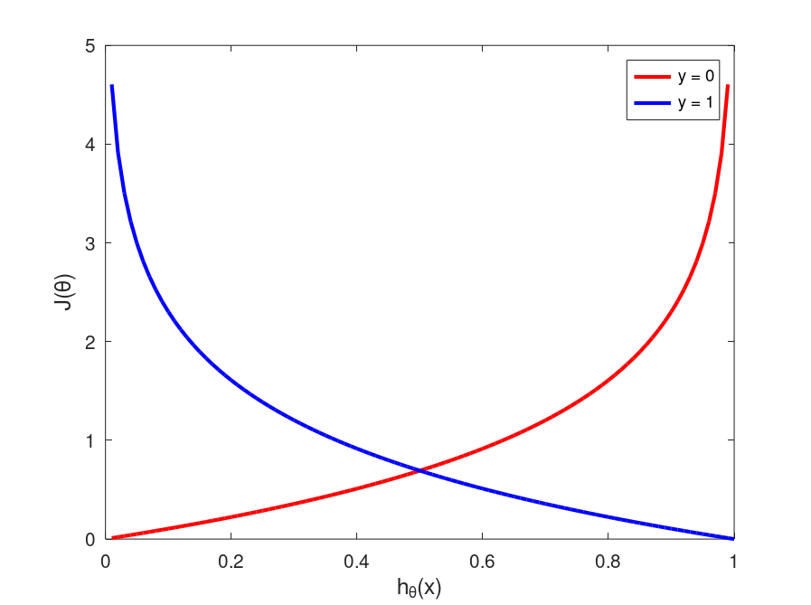

# Week 3 Notes

## Classification and Representation

### Classification

Logistic regression can be used to classify data. For these types of problems, the solutions for training data are binary, *i.e*., $y \in \{0,1\}$, where $0$ is $false$ ("negative class") and $1$ is $true$ ("positive class"). This model can also be applied to multi-class problems ($y \in \{0,1,\dots,n\}$)

For an example, say you want to classify tumors as either malignant ($1$) or benign ($0$) based on their size. To start, you could apply the linear regression algorithm and get a straight-line fit to the data. Recall the hypothesis function for linear regression is $h_\theta(x)=\theta^Tx$. This would produce a prediction threshold value of $0.5$ for classifying malignancy. In other words, if $h_\theta(x) \ge 0.5 \rightarrow y = 1$ and if $h_\theta(x) \lt 0.5 \rightarrow y = 0$.

<div align="center">
  

  <span>Figure 1. Linear Regression fit for Tumor Data<span>
</div>

However, adding another data point to the right that is also malignant will skew the fit so that the hypothesis equation will no longer accurately predict whether a tumor is malignant or not. Hence, we turn to logistic regression analysis instead of linear regression.

### Hypothesis Representation

We want to generate a hypothesis function that satisfies $0 \le h_\theta(x) \le 1$. We can modify the model from linear regression to be $h_\theta(x) = g(\theta^Tx)$, where $g(z)=\frac{1}{1+e^{-z}}, z \in \R$, called the "logistic" or "sigmoid" function. So our new hypothesis function becomes:

$
h_\theta(x)=\frac{1}{1+e^{-\theta^Tx}}
$

$h_\theta(x)$ now outputs the probability of $y=1$.

<div align="center">
  

  <span>Figure 2. Sigmoid function<span>
</div>

### Decision Boundary

The function $g(z)$ will be greater than or equal to $0.5$ (*i.e.*, we predict that $y=1$) whenver $z \ge 0$, and so $h_\theta(x) = g(\theta^Tx) \ge 0.5$ when $\theta^Tx \ge 0$

Let's imagine a hypothesis function $h_\theta(x) = g(\theta_0 + \theta_1x_1 + \theta_2x_2)$ and choose $\theta^T = \begin{bmatrix}-3 & 1 & 1\end{bmatrix}$. So then $y=1$ if $-3 + x_1 + x_2 \ge 0$. Plotting the line for $x_1 + x_2 = 3$ then separates a plot of $x_1$ *vs.* $x_2$ into two regions - above and the the right of the line corresponds to $y = 1$ and below and left corresponds to $y = 0$. This line is called the *decision boundary*. This boundary is a property of the hypothesis function, and not the data set.

#### Non-linear Decision Boundaries

Decision boundaries can also be non-linear functions. For instance, if the hypothesis function is polynomial with respect to certain features, then the equation for the boundary will also potentially be non-linear.

## Logistic Regression Model

### Cost Function

Defining the problem:

**training set**: $\{(x^{(1)},y^{(1)},(x^{(2)},y^{(2)}, \dots, (x^{(m)},y^{(m)}\}$ with $m$ examples and $x \in \begin{bmatrix}x_0 \\ x_1 \\ \vdots \\ x_n\end{bmatrix}, x_0 = 1, y \in \{0,1\}$.

**hypothesis function**: $h_\theta(x) = \frac{1}{1+e^{-\theta^Tx}}$

How to fit for $\theta$?

Recall the cost function for linear regression:

$J(\theta) = \frac{1}{m} \sum\limits_{i=1}^m Cost\left(h_\theta(x^{(i)}),y^{(i)}\right)$

where $Cost\left(h_\theta(x^{(i)}),y^{(i)}\right) = \frac{1}{2}\left(h_\theta(x^{(i)}) - y^{(i)}\right)^2$. When fitting the training set described above, $J(\theta)$ will be a "non-convex" function, meaning that it has many local optima, so applying gradient descent to determine $\theta$ will not necessarily work.

In order to have a "convex" function for $J(\theta)$, we will use a different cost function, defined as follows:

$$
Cost(h_\theta(x),y) = \begin{cases}
-\log(h_\theta(x)) &\text{if } y = 1 \\
-\log(1-h_\theta(x)) &\text{if } y = 0
\end{cases}
$$

This produces a convex function for $J(\theta)$, as shown in [Figure 3](logistic_cost_function.png).

<div align="center">
  

  <span>Figure 3. Logistic cost function<span>
</div>

This captures the intuition that if $h_\theta(x) = 0$ but $y = 1$, the learning algorithm will be heaviliy penalized (as $h_\theta(x)\rightarrow0$, $J\rightarrow \infty$). The converse is also true.

### Simplified Cost Function and Gradient Descent

We can simplify the $Cost$ function defined above by writing it as follows:

$Cost(h_\theta(x),y = -y\log\left(h_\theta(x)\right) - (1 - y)\log\left(1 - h_\theta(x)\right)$

where $y = \{0,1\}$. Given this, our full logistic regression cost function becomes:

$
J(\theta) = -\frac{1}{m}\left[\sum\limits_{i=1}^m y^{(i)}\log h_\theta(x^{(i)}) + (1 - y^{(i)})\log(1-h_\theta(x^{(i)})\right]
$

To fit parameters $\theta$, the problem becomes $\underset{\theta}{\text{min }}J(\theta)$. We again apply the gradient descent algorithm:

$
\begin{aligned}
\text{repeat } &\{\\
&\theta_j := \theta_j -\alpha \frac{\partial}{\partial\theta_j}J(\theta) = \theta_j - \alpha \frac{1}{m}\sum\limits_{i=1}^{m}\left(h_\theta(x^{(i)}-y^{(i)}) \right) x_j^{(i)}\\
\}&\,
\end{aligned}
$

Surprisingly, this is identical to the algorithm for linear regression, albeit with a different definition for $h_\theta(x)$.

### Advanced Optimization

From a coding perspective, we need to implement functions to compute $J(\theta)$ and $\frac{\partial}{\partial\theta_j}J(\theta)$. Other optimization algorithms can be used to further optimize this process, including *conjugate gradient*, *BFGS*, and *L-BFGS*. The advantages of these alternate algorithms include not needing to choose a learning rate $\alpha$, and often being faster than gradient descent; however, they are more complex.

Rather than coding these algorithms manually, just use a built-in library.

Let's look at an example.

$\theta = \begin{bmatrix}\theta_1 \\ \theta_2\end{bmatrix}$

$J(\theta) = (\theta_1 - 5)^2 + (\theta_2 - 5)^2$

$\frac{\partial}{\partial\theta_1}J(\theta) = 2(\theta_1 - 5)$, $\frac{\partial}{\partial\theta_2}J(\theta) = 2(\theta_2 - 5)$

The minimum values of $\theta$ are $\theta_1, \theta_2 = 5$.

In code:

```matlab
% costFunction.m
function [jVal, gradient] = costFunction(theta)
  jVal = (theta(1)-5)^2 + (theta(2)-5)^2;
  gradient = zeros(2,1);
  gradient(1) = 2*(theta(1)-5);
  gradient(2) = 2*(theta(1)-5);
end

options = optimset('GradObj', 'on', 'MaxIter', '100');
initialTheta = zeros(2,1);
[optTheta, functionVal, exitFlag] = fminunc(@costFunction, initialTheta, options);
```

Documentation for [`fminunc`](https://octave.sourceforge.io/octave/function/fminunc.html).

## Multiclass Classification

### One-vs-all

Example problem: automatic email tagging for `work` ($y=1$), `friends` ($y=2$), `family` ($y=3$), and `hobby` ($y=4$).

For each class of $y$, separate the data set into single binary classification problems. Practically, this can be achieved using one-hot-encoding for each class.

To summarize:
- train a logistic regression classifier $h_\theta^{(i)}(x)$ for each class $i$ to predict the probability that $y=i$
- on a new input $x$, to make a prediction, pick the class $i$ that maximizes $\text{max}_i\ h_\theta^{(i)}(x)$

## Solving the Problem of Overfitting

### Overfitting

Thinking back to our dataset of housing price *vs*. size (see Figure 4), we can imagine many different hypothesis functions to fit the training data.

<div align="center">
  

  <span>Figure 3. Logistic cost function<span>
</div>

A linear function, such as $h_\theta(x) = \theta_0 + \theta_1x$, will produce a fit that is "underfit" and "high bias". Another hypothesis function such as $h_\theta(x)=\theta_0 + \theta_1x + \theta_2x^2$ will produce a better fit. Increasing the number of features even further (and hence the number of fitting parameters) could technically produce an even better fit, producing a hypothesis function that perfectly passes through each data point. However, the shape of this function will not make sense, and won't be a reflection of the real shape of the dataset. This is a condition called "overfitting" or "high variance", and it can lead to failure to generalize.

To address overfitting, there are two general options:

1. Reduce the number of features
   - manual selection
   - model selection algorithm
2. Regularization
   - keep all the fatures, but reduce the magnitude of the parameters
   - works well for many features

### Cost Function

To combat overfitting, certain parameters can be forced to contribute minimally to the hypothesis function. By keeping values of $\theta$ small, generally a better hypothesis function can be obtained. To acheive this, we can modify the cost function as follows:

$
J(\theta) = \frac{1}{2m} \left[ \sum\limits_{i=1}^m \left(h_\theta(x^{(i)})-y^{(i)})^2\right) + \lambda \sum\limits_{i=1}^n \theta_j^2 \right]
$

where $\lambda$ is the regularization parameter. If $\lambda$ is too large, then the algorithm will likely result in a $h_\theta(x)$ that is underfit.

### Regularized Linear Regression

Gradient descent:

$
\begin{aligned}
\text{repeat } &\{\\
&\theta_0 := \theta_0 - \alpha \frac{1}{m}\sum\limits_{i=1}^{m}\left(h_\theta(x^{(i)}-y^{(i)}) \right)x_0^{(i)} \\
&\theta_j := \theta_j - \alpha \left[ \frac{1}{m}\sum\limits_{i=1}^{m}\left(h_\theta(x^{(i)}-y^{(i)}) \right) x_j^{(i)} + \frac{\lambda}{m}\theta_j \right]\\
\}&\,
\end{aligned}
$

The update algorithm for $\theta_j$ can also be re-written as:

$
\theta_j := \theta_j(1 - \alpha\frac{\lambda}{m}) - \alpha\frac{1}{m} \sum\limits_{i=1}^m \left( h_\theta(x^{(i)})-y^{(i)}\right)x_j^{(i)}
$

Note that the term $(1-\alpha\frac{\lambda}{m})$ will always be $<1$.

Normal Equation:

$
X = \begin{bmatrix}
(x^{(1)})^T \\
\vdots \\
(x^{(m)})^T
\end{bmatrix},
\quad y = \begin{bmatrix}
y^{(1)} \\
\vdots \\
y^{(m)}
\end{bmatrix}
$

$\underset{\theta}{\text{min}}J(\theta)\rightarrow\frac{\partial}{\partial\theta_j}J(\theta)\overset{\text{set}}{=}0$

$\theta = \left( X^TX + \lambda M\right)^{-1}X^Ty$

where $M$ is an $(n+1)\times(n+1)$ dimensional matrix with $1$s on the diagonal except for the $(1,1)$ position and $0$s everywhere else. *E.g.*, for $n=2$,

$
M = \begin{bmatrix}
0 & 0 & 0 \\
0 & 1 & 0 \\
0 & 0 & 1
\end{bmatrix}
$

Again, in the case where $m \le n$, then the matrix $(X^TX)$ will be non-invertible. However, using the regularized form of the equation, and with $\lambda \gt 0$, the term $(X^TX + \lambda M)$ will be invertible.

### Regularized Logistic Regression

The same algorithm for updating $\theta_j$ as discussed above applies here, where $h_\theta(x) = \textstyle{{1}/({1+e^{-\theta^Tx}})}$.

The full expression for the regularized cost function for logistic regression is:

$
J(\theta)= -\frac{1}{m} \sum\limits_{i=1}^m\left(y^{(i)}\log(h_\theta(x^{(i)})+(1-y^{(i)})\log(1-h_\theta(x^{(i)}))\right) + \frac{\lambda}{2m}\sum\limits_{j=1}^n\theta_j^2
$

The derivative terms will also be adjusted to include a $\lambda$ term (except for $\partial/\partial\theta_0J(\theta)$). For instance, the equation to calculate `gradient(2)` (the second term in the gradient matrix) will be:

$
\frac{\partial}{\partial\theta_1}J(\theta) = \frac{1}{m} \sum\limits_{i=1}^m(h_\theta(x^{(i)}) - y^{(i)})x_2^{(i)} + \frac{\lambda}{m}\theta_1
$

### Quiz - Regularization

#### Question 1

You are training a classification model with logistic regression. Which of the following statements are true?

- Introducing regularization to the model always results in equal or better performance on examples not in the training set `False`
- Introducing regularization to the model always results in better performance on the training set `False`
- Adding many new features to the model helps to prevent overfitting on the training set `False`
- Adding a new feature to the model always results in equal or better performance on the training set `True`

