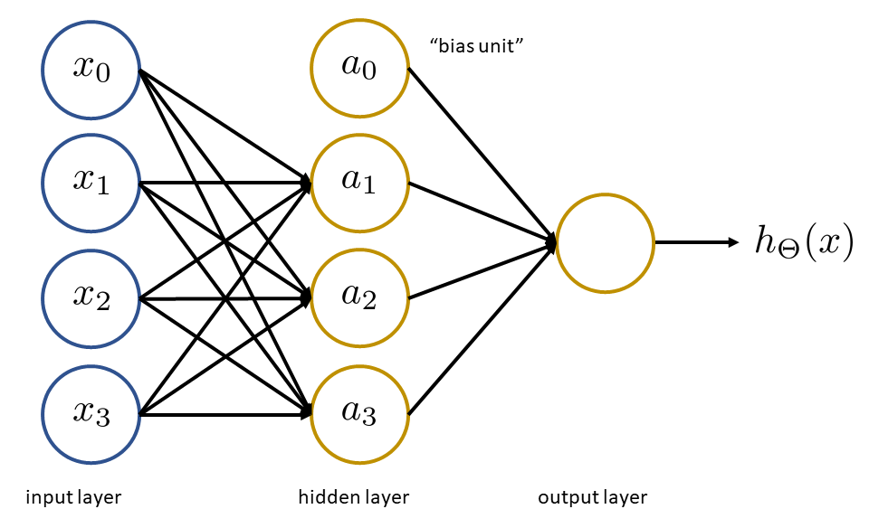

# Week 4 Notes

## Motivations

### Non-linear Hypotheses

Consider a classification dataset that would require a hypothesis function with many terms, including polynomials, to fit accurately. With a large number of features, this equation can quickly grow to contain a large number of terms. With 100 features for example, there will be over 5000 quadratic terms in the hypothesis function. In general, the quadratic terms in the equation scale as $\approx n^2/2$.

Many problems in machine learning are too complex in their features to use simple logistic functions or regression algorithms. One such example is computer vision, where an AI is trained to classify images based on the content of the pixels it sees. For images that are $50\times50$ pixels in size, this amounts to $2500$ pixels, *i.e.*, the feature matrix contains $2500$ elements, each with a value $0 \le x \le 255$ (for greyscale images). RGB images would be even more complex. The number of quadratic features $(x_i\times x_j)$ is then $\approx 3$ million. This is computationally expensive.

Neural networks can be employed to ascertain complex non-linear hypotheses.

### Neurons and the Brain

Neural networks are algorithms that try to mimic the brain. The [one learning algorithm hypothesis](https://cenksezgin.com/the-one-learning-algorithm-hypothesis-166647115f2) states that the brain uses only one mode of learning, meaning that any part of the brain can be used to "learn". Some evidence for this was found when researchers severed the "connection" between the ears and the auditory cortex of animal brains, and re-wired the input from the eyes to the same region. The auditory cortex was then observed to "learn to see," as if the eyes had never been re-wired. In other words, there should exist only one algorithm that governs all learning that takes place in the brain.

## Neural Networks

### Model Representation I

Continuing the analogy of neurons in the brain, a `neuron` in the computational sense is a "cell" that receives several inputs (*via* "dendrites") and produces outputs ("axons"). The axons of one neuron provides the input for another neuron's dendrites, and so on. So a `neural network` is just a collection of these `neuron`s.

A single `neuron` will take inputs $x$ and provide some outputs $h_\theta(x)$, where $x$ and $\theta$ are the usual feature and parameter (or weight) column vectors we are familiar with, respectively. Layers of the `neural network` are built by stringing chains of `neuron`s together. The final hypothesis is often denoted $h_\Theta(x)$.

  

  Figure 1. Neural network visualization

Further, we often denote the "layer" of a neuron in its superscript, *i.e.*, $a_i^{(j)}$ is the "activation" of unit $i$ in layer $j$. $\Theta^{(j)}$ is the matrix of weights controlling the function mapping from layer $j$ to $j+1$. So in Figure 3, the full representation of the functions is as follows:

$
\begin{aligned}
a_1^{(2)} &= g\left(\Theta_{10}^{(1)}x_0 + \Theta_{11}^{(1)}x_1 + \Theta_{12}^{(1)}x_2 + \Theta_{13}^{(1)}x_3\right) \\
a_2^{(2)} &= g\left(\Theta_{20}^{(1)}x_0 + \Theta_{21}^{(1)}x_1 + \Theta_{22}^{(1)}x_2 + \Theta_{23}^{(1)}x_3\right) \\
a_3^{(2)} &= g\left(\Theta_{30}^{(1)}x_0 + \Theta_{31}^{(1)}x_1 + \Theta_{32}^{(1)}x_2 + \Theta_{33}^{(1)}x_3\right) \\
h_\Theta(x) &= a_1^{(3)} = g\left(\Theta_{30}^{(2)}a_0 + \Theta_{11}^{(2)}a_1 + \Theta_{12}^{(2)}a_2 + \Theta_{13}^{(2)}a_3\right)
\end{aligned}
$

with $3$ input units, $3$ hidden units, and $g$ is the sigmoid function. $\Theta$ will therefore be a $(3\times4)$ dimensional matrix. In general, if a network has $s_j$ units in layer $j$, $s_{j=1}$ units in layer $j+1$, then $\Theta^{(j)}$ will be of dimension $s_{j+1}\times(s_j + 1)$.

### Model Representation II

Define $\Theta_{10}^{(1)}x_0 + \Theta_{11}^{(1)}x_1 + \Theta_{12}^{(1)}x_2 + \Theta_{13}^{(1)}x_3 = z_1^{(2)}$ so that $a_1^{(2)}=g(z_1^{(2)})$. Using this definition, we can vectorize the neural network operations defined above. If

$
x = \begin{bmatrix}
x_0 \\
x_1 \\
x_2 \\
x_3
\end{bmatrix}, \quad
z^{(2)} = \begin{bmatrix}
z_1^{(2)} \\
z_2^{(2)} \\
z_3^{(2)} \\
\end{bmatrix}
$

then $z^{(2)} = \Theta^{(1)}x$ and $a^{(2)} = g(z^{(2)})$. To keep our notation consistent, we can also redifine $x = a^{(1)}$, and also specify that $a_0^{(2)}=1$. This means $z^{(2)} = \Theta^{(1)}a^{(1)}$, $z^{(3)} = \Theta^{(2)}a^{(2)}$, and $h_\Theta(x)=a^{(3)}=g(z^{(3)})$. This process of computing the hypothesis is called "forward propagation".

So neural networks are doing the same thing as logistic regression, where the features from the training data are instead used to create new features ($a$). These features are "learned" by applying a mapping $x$ through $\Theta$ to get $a$.

## Applications

### Examples and Intuitions I

Simple example: $x_1,\ x_2 \in \{0,1\}$ and $y = x_1 \text{ AND } x_2$.

The neural network model will have three inputs (including the bias input of $x_0=1$), and $h_\Theta(x) = g(\Theta_{10}^{(1)}x_0 + \Theta_{11}^{(1)}x_1 + \Theta_{12}^{(1)}x_2)$. We will choose $\Theta_{10},\ \Theta_{11},\ \Theta_{12} = -30,\ 20,\ 20$ for now.

| $x_1$ | $x_2$ | $h_\Theta(x)$      |
|:-----:|:-----:|:-------------------|
| 0     | 0     | $g(-30) \approx 0$ |
| 0     | 1     | $g(-10) \approx 0$ |
| 1     | 0     | $g(-10) \approx 0$ |
| 1     | 1     | $g(10) \approx 1$  |

### Examples and Intuitions II

Consider the non-linear classification example of XOR/XNOR, where $x_1,\ x_2 \in \{0,1\}$ and $y = (x_1 \text{ XNOR }x_2)$

| $x_1$ | $x_2$ | $a_1^{(2)}$ | $a_2^{(2)}$ | $h_\Theta(x)$      |
|:-----:|:-----:|:-----------:|:-----------:|:------------------:|
| 0     | 0     | 0 | 1 | 1 |
| 0     | 1     | 0 | 0 | 0 |
| 1     | 0     | 0 | 0 | 0 |
| 1     | 1     | 1 | 0 | 1 |

### Multiclass Classification

When trying to classify multiple different things, we use a one-vs-all method. We want to develop a model such that each class of objects has a distinct output of the hypothesis function, for instance

$
h_\Theta(x) = \begin{bmatrix}
1 \\
0 \\
0 \\
0
\end{bmatrix}, \text{when 'pedestrian'};\quad h_\Theta(x) = \begin{bmatrix}
0 \\
1 \\
0 \\
0
\end{bmatrix}, \text{when 'car'};\ etc.
$

